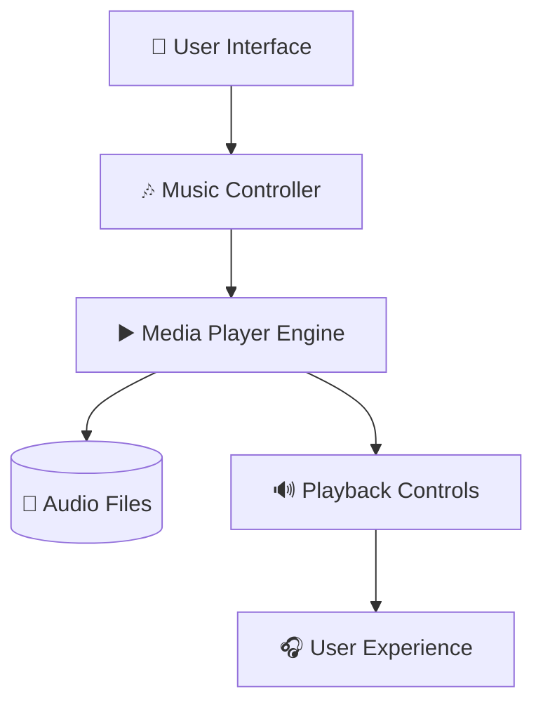

<div align="center">


<br>


<br><br>


</div>

---

# 🎵 About The Application

## 📱 Music App Using Android Studio

A sleek and modern Android music player application developed using **Android Studio** that delivers a smooth music listening experience with elegant UI design and powerful playback controls.

This application is designed to provide:

- 🎧 Seamless audio playback
- 📂 Music library management
- 🔊 High-quality sound experience
- ⚡ Fast and responsive performance
- 📱 Mobile-friendly interface
- 🎶 Interactive media controls

Android music applications commonly implement multimedia handling, playlist management, and responsive UI systems to improve user experience. :contentReference[oaicite:0]{index=0}

---

# ✨ Main Features

<div align="center">

| 🎼 Feature | 🚀 Description |
|---|---|
| ▶️ Play Music | Start audio playback instantly |
| ⏸️ Pause & Resume | Smooth playback control |
| ⏭️ Next / Previous | Navigate songs easily |
| 🔊 Volume Control | Manage sound levels |
| 📂 Music Library | Browse stored songs |
| 🎧 Background Playback | Continue music while multitasking |
| 🎵 Dynamic UI | Attractive music interface |
| ⚡ Lightweight Performance | Optimized mobile experience |

</div>

---

# 🌌 Application Design Concept

<div align="center">



</div>

---

# 🛠️ Tech Stack

<div align="center">

<table>

<tr>

<td align="center" width="180">
<br>
<b>Android Studio</b>
</td>

<td align="center" width="180">
<br>
<b>Java</b>
</td>

<td align="center" width="180">
<br>
<b>Kotlin</b>
</td>

<td align="center" width="180">
<br>
<b>Firebase</b>
</td>

</tr>

<tr>

<td align="center" width="180">
<br>
<b>Gradle</b>
</td>

<td align="center" width="180">
<br>
<b>Git</b>
</td>

<td align="center" width="180">
<br>
<b>GitHub</b>
</td>

<td align="center" width="180">
<br>
<b>SQLite</b>
</td>

</tr>

</table>

</div>

---

# 📸 UI Preview

<div align="center">


</div>

---

# 🎧 Core Modules

## 🎼 Music Playback Engine
- Play local audio files
- Smooth media handling
- Background playback support

## 📂 Music Library
- Display stored music
- Organize songs efficiently

## 🎛️ Playback Controls
- Play / Pause
- Next / Previous
- Seek bar support

## 📱 Responsive Interface
- Mobile optimized layouts
- Modern user experience

Open-source Android music player projects often include playlist management, media controls, and local music browsing features. :contentReference[oaicite:1]{index=1}

---

# 📂 Folder Structure

```bash
📦 Music-App
 ┣ 📂 app
 ┃ ┣ 📂 java
 ┃ ┣ 📂 res
 ┃ ┣ 📂 layouts
 ┃ ┗ 📂 drawable
 ┣ 📂 assets
 ┣ 📂 screenshots
 ┣ 📜 AndroidManifest.xml
 ┣ 📜 build.gradle
 ┣ 📜 settings.gradle
 ┣ 📜 README.md
 ┗ 📜 .gitignore
```

---

# ⚙️ Installation Process

## 📥 Clone Repository

```bash
git clone https://github.com/Nksnaveenks/Music-App-Using-Mobile-App-Development-Android-studio.git
```

---

## 📂 Open Project

Open using:

```bash
Android Studio
```

Android Studio provides the official development environment for Android application development with Gradle integration and emulator support. :contentReference[oaicite:2]{index=2}

---

## ▶️ Run Application

### Step 1
Connect Android device OR launch emulator.

### Step 2
Click:

```bash
Run ▶️
```

### Step 3
Application launches successfully 🚀

---

# 🎯 Project Objectives

✅ Learn Android app development  
✅ Implement audio playback features  
✅ Understand MediaPlayer integration  
✅ Build responsive mobile interfaces  
✅ Improve multimedia handling skills  

Tutorials and sample projects commonly use Android music apps to teach multimedia handling and Android UI development concepts. :contentReference[oaicite:3]{index=3}

---

# 🚀 Future Enhancements

- 🌙 Dark Mode Support
- ☁️ Cloud Music Integration
- 🎤 Voice Search Feature
- ❤️ Favorite Playlist System
- 📡 Online Streaming Support
- 🎵 Equalizer Integration
- 🔔 Smart Notifications

---

# 📚 Learning Outcomes

<div align="center">

| 📘 Concept | 🚀 Skills Learned |
|---|---|
| Android UI Design | Modern mobile interfaces |
| MediaPlayer API | Audio playback handling |
| Database Management | Music storage handling |
| Android Lifecycle | Background playback |
| Mobile Development | Full Android workflow |

</div>

---

# 🤝 Contribution Guide

## 🚀 Contributing Steps

### 1️⃣ Fork Repository

### 2️⃣ Clone Repository

```bash
git clone https://github.com/your-username/Music-App-Using-Mobile-App-Development-Android-studio.git
```

### 3️⃣ Create New Branch

```bash
git checkout -b feature-name
```

### 4️⃣ Commit Changes

```bash
git commit -m "Added new feature"
```

### 5️⃣ Push Changes

```bash
git push origin feature-name
```

### 6️⃣ Open Pull Request 🎉

---

# 🛡️ License

Distributed under the **MIT License**.

---

# 👨‍💻 Developer

<div align="center">


# 🚀 Naveen K S

### Associate Software Engineer @ Accenture

<br>

<a href="https://github.com/Nksnaveenks">

</a>

<a href="https://linkedin.com">

</a>

</div>

---

# 💭 Inspiration

> “Music gives a soul to the universe, wings to the mind, and life to everything.”

---

<div align="center">


# ⭐ Support The Project By Giving It A Star ⭐

</div>
